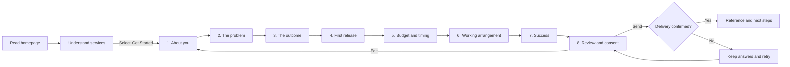

# Customer Project Discovery Journey

Status: Implementation-ready experience specification  
Last reviewed: 3 August 2026  
Owner: Lang Systems

## 1. Purpose and experience promise

This document defines the end-to-end experience from reading the Lang Systems homepage to submitting a project enquiry. It is governed by the [Project Anchor](project-anchor.md) and complements the [Project Intake Architecture and Design](project-intake-architecture.md).

The customer is a business owner or manager who understands their operational problem but may not know what software is appropriate. The experience must communicate:

> You do not need to know what technology you need. Tell us what you are trying to achieve, and we will handle the technical translation.

The first release is a guided email enquiry with manual review. It is not an account, portal, quote, contract, payment flow, or promise that Lang Systems has accepted the project.

Design principles:

- Ask about the business situation, people, impact, and desired outcome before a solution.
- Present one manageable subject at a time, explain why it matters, and identify optional questions.
- Use familiar language and let customers say "Not sure" where Lang Systems can recommend an approach.
- Preserve answers through backtracking, editing, and recoverable submission errors.
- Show the complete enquiry before explicit, unselected consent and submission.
- Open only after an intentional project-enquiry action; never use automatic prompts.
- Never put answers in URLs, browser storage, analytics, logs, or source control.
- Never request passwords, payment details, health records, government identifiers, or other highly sensitive information.

## 2. Recommended journey

Use eight steps. This separates the enquiry into coherent subjects without creating a long series of tiny screens. Review counts as a step so the progress indicator is honest from the start.

### Written customer flow

1. The visitor reads the homepage without the intake appearing automatically. The page explains that Lang Systems creates practical software, connects existing tools, and improves workflows.
2. The visitor intentionally selects "Get Started" or "Tell us about your project". A focused discovery dialog opens and reassures them that technical knowledge is not expected.
3. The visitor completes one subject at a time. Continue validates only the visible section; Back never validates or removes answers.
4. Progress always gives the current step number, total, and name. Optional questions are clearly labelled.
5. Review shows every answer under the same seven section names. Optional blanks say "Not provided" rather than disappearing or being inferred.
6. An Edit control returns the visitor to the relevant section with existing answers populated. Normal Continue behaviour returns them through the remaining sections to a rebuilt review.
7. The visitor reads what happens next, actively gives the required consent, and selects "Send project outline".
8. While sending, navigation and Send are disabled and a status is announced. Success appears only after the delivery service confirms the request.
9. The receipt shows the project reference, confirmation email address, and next steps. Lang Systems then manually reviews, confirms its understanding, and contacts the customer without implying agreed price, scope, timing, or acceptance.

## 3. Step and question specification

The [Plain-English Client Discovery Question Set](client-discovery-question-set.md) is the complete approved question catalogue. The concise step tables below describe the original version 1.0 journey; where the catalogue adds a question or choice, a later implementation change must add it without weakening the interaction, accessibility, privacy, or validation rules in this document.

Required questions block Continue when empty or invalid. Optional questions can reduce follow-up but never block progress.

### Step 1 - About you

**Purpose:** Identify the contact and provide enough business context for a relevant response.

Intro: "First, who should we speak with? This helps us understand the business context and respond to the right person."

| Question | Required | Guidance |
| --- | --- | --- |
| Your name | Yes | "Tell us what you would like us to call you." |
| Work email | Yes | Email input; "We will send your confirmation here." |
| Phone | No | Telephone input |
| Business or organisation | Yes | Short text |
| What does your business do? | Yes | "A short, plain-English description is perfect." |

### Step 2 - The problem

**Purpose:** Understand today's situation and business effect before discussing a solution.

Intro: "What is happening today? Describe the situation as you would to a colleague. Technical detail is not expected."

| Question | Required | Guidance |
| --- | --- | --- |
| What problem or opportunity would you like help with? | Yes | Example: copying order details between systems is causing mistakes |
| How do you handle this today? | Yes | Ask for the current process, manual steps, and workarounds |
| Who is affected, and what impact does it have? | Yes | Prompt for time, cost, errors, risk, customer experience, or missed opportunities |

### Step 3 - The outcome

**Purpose:** Define the better result, its users, and relevant business information without asking the customer to design software.

Intro: "What would a better result look like? Focus on what people should be able to do, not how the software should be built."

| Question | Required | Guidance |
| --- | --- | --- |
| What would you like the new solution to achieve? | Yes | Focus on outcomes |
| Who will use it? | Yes | Examples: office staff, field teams, managers, or customers |
| Existing software the new system may need to connect with | No | Examples: accounting, payments, spreadsheets, website, or email |
| Information the system may need to store or use | No | Examples: customer records, orders, documents, or reports |

### Step 4 - First release

**Purpose:** Separate immediate needs from later possibilities so the first delivery remains practical.

Intro: "Shape a practical first release. Separating essentials from later ideas keeps the first delivery clear and achievable."

| Question | Required | Guidance |
| --- | --- | --- |
| Essential for the first release | Yes | "What must people be able to do from day one?" |
| Useful, but can be added later | No | Long text |
| Future ideas | No | Long text |
| Anything specifically not included? | No | Include work the customer's team or another supplier will handle |

### Step 5 - Budget and timing

**Purpose:** Help Lang Systems recommend a realistic approach.

Intro: "Help us recommend a realistic approach. Estimates can be refined after discovery. A range is enough at this stage."

| Question | Required | Choices or guidance |
| --- | --- | --- |
| Expected investment | Yes | Under AUD $5,000; AUD $5,000-$15,000; AUD $15,000-$40,000; AUD $40,000-$100,000; Over AUD $100,000; Not sure - please advise |
| Preferred timing | Yes | As soon as practical; Within 1-2 months; Within 3-6 months; More than 6 months away; Exploring options only |
| Is there an important date or reason for the timing? | No | Launch, contract, busy season, compliance date, or dependency |

### Step 6 - Working arrangement

**Purpose:** Record a non-binding preference for ownership, day-to-day responsibility, and ongoing help.

Intro: "How would you prefer to work together? It is completely fine not to know. We can recommend the most suitable arrangement."

| Question | Required | Choices |
| --- | --- | --- |
| Preferred commercial arrangement | Yes | Please recommend the best approach (default); We want to own the finished solution; We are open to licensing a Lang Systems product; We may be interested in a product partnership |
| Who will manage the solution day to day? | Yes | Our team; Lang Systems; A shared responsibility; Not sure yet |
| Ongoing help after launch | Yes | Ongoing support; Occasional support; Handover and documentation only; Not sure yet |

Each commercial choice has a one-sentence plain-language explanation. A choice does not create an ownership, licence, support, or partnership agreement.

### Step 7 - Success

**Purpose:** Capture observable completion measures and business rules that may affect the work.

Intro: "How will we know the project is complete? Clear completion measures help both teams agree when the first release is ready."

| Question | Required | Guidance |
| --- | --- | --- |
| What must be working before the project can be considered complete? | Yes | Ask for results or tasks people must be able to complete |
| Important rules, constraints, or concerns | No | Privacy, approvals, locations, accessibility, industry rules, devices, or policies |
| Anything else we should know? | No | Long text |

### Step 8 - Review

**Purpose:** Verify the complete enquiry, correct it, understand next steps, and provide informed consent.

Display every answer in step order. Each group has a specifically named Edit button, such as "Edit Budget and timing". Optional blanks display "Not provided". Do not show internal summaries, assumptions, or generated clarification questions as if the customer wrote them.

The required checkbox starts clear and says:

> I agree that Lang Systems may use this information to assess my enquiry and contact me about it. I understand it will be sent through an email delivery service. I have not included passwords, payment details, health records, or other highly sensitive information.

Before Send, state that Lang Systems will review the information, confirm its understanding, and contact the customer with questions or recommended next steps.

## 4. Interaction behaviour

### Entry, progress, and navigation

- Discovery is closed on load and is never triggered by time, scrolling, exit intent, or page return. All project-enquiry calls to action open the same journey.
- Opening closes mobile navigation if necessary and records the trigger for focus restoration. A new page load starts at step 1; reopening on the same live page returns to the last viewed step.
- The modal makes background content inert. Its visible title and introduction precede the first question.
- Show `Step N of 8`, the step name, and a visual bar. Expose a progress bar with minimum 1, maximum 8, current value, and text such as "Step 3 of 8: The outcome". Announce changes politely.
- Progress is not clickable in the first release, preventing accidental bypass of required sections. Review provides direct Edit controls.
- Continue validates the visible step and advances one step. Back moves one step without validation and is unavailable on step 1. Both retain all values.
- Do not bind Enter globally. It inserts new lines in long text and otherwise follows the focused control's native behaviour.
- Edit opens the chosen section and focuses its heading. Rebuild Review from current values whenever it is entered.

### Validation and consent

- Validate on Continue or Send, not while the customer is composing.
- Name the first invalid question in a plain-language alert, set `aria-invalid="true"`, connect the error using `aria-describedby`, and focus the control or radio group.
- Example wording: "Please enter a valid email address for Work email" and "Please complete Essential for the first release before continuing".
- Preserve valid answers, clear a field's error when it changes, and never rely on colour alone.
- Recheck all required fields and consent before sending. Consent is required, understandable, and never preselected.

### Save, exit, and browser behaviour

- First-release progress exists only in the live page's memory. Back, Edit, close/reopen, and failed submission preserve answers while that page remains loaded.
- Do not use local storage, session storage, cookies, URLs, or analytics to save values. Refresh, navigation, tab close, or a crash may discard the unfinished enquiry.
- Close and Escape request exit. With no changes, close immediately. With unfinished changes, offer "Keep working" and "Close discovery", explaining: "Your answers will remain available if you reopen discovery on this page, but they will be lost if you refresh or leave the page."
- Close does not reset answers and returns focus to the exact opening control.
- Browser Back remains browser navigation, not wizard navigation; the labelled wizard Back control moves between sections. When unfinished answers exist, use the browser's page-leave warning for refresh, tab close, and navigation where supported. Stay preserves the exact state; Leave abandons it. Never trap someone after they confirm leaving.
- Never add answers to browser history. During sending, disable navigation. If exit is requested, explain that delivery may already be in progress before cancelling the local request.

### Submission and success

- On Send, disable Send and Back, set a busy state, change the label to "Sending...", and announce "Sending your project outline securely...".
- Prevent repeat activation, never show optimistic success, and never retry automatically.
- Generate the documented `LS-...` correlation reference in the payload. It is for follow-up, not proof of permanent storage or a project number.
- Show success only after an explicit successful provider response. Focus the success panel.
- Show "Project outline received", the same reference sent in the payload, the customer's confirmation email, and the manual next steps.
- Suggested wording: "Thank you. We will take it from here. Your reference is [reference]. We have sent a confirmation to [email]. Lang Systems will review your outline, confirm our understanding, and contact you with any questions or recommended next steps."
- Close restores focus to the opener. Reopening after success may show the receipt for the page lifetime, but must not permit accidental duplicate sending.

## 5. Responsive layout

### Desktop

- Use a centred modal that keeps some homepage context without cramping the form.
- Keep header/progress above and actions consistently below a scrollable question region on short viewports.
- Use two columns only for short related fields, such as name/email or budget/timing. Long answers span the width.
- Review may use two columns only when DOM and visual reading order remain the same. Guidance and actions cannot rely on hover.

### Mobile

- Use a full-height sheet with viewport and safe-area support. Use one content column and no horizontal scrolling.
- Keep Close, progress, and step name available without consuming excessive height. Content scrolls and cannot hide behind the action footer or keyboard.
- Stack actions at narrow widths, with Continue/Send visually primary and Back easy to find. Use at least 44 by 44 CSS-pixel targets where practical.
- Long email addresses, answers, and references wrap safely. On keyboard close or step change, return to the heading; avoid animated scrolling when reduced motion is requested.

## 6. Accessibility and focus

### Keyboard navigation

- All entry actions, fields, choices, Edit buttons, navigation, Send, Close, and Retry are reachable in logical Tab order with visible focus.
- The native modal dialog or an equivalent tested focus trap keeps Tab and Shift+Tab inside. Space and arrow keys retain native checkbox/radio behaviour; Escape follows the exit rule.

### Screen-reader considerations

- Use native labels, fieldsets/legends, buttons, selects, and required attributes. Optional wording is part of the visible label. DOM order matches visual order.
- Give the dialog an accessible name. Expose progress programmatically, announce step changes politely, and use one assertive alert for blocking errors.
- Decorative step numbers, icons, and success marks are hidden from assistive technology. Hidden steps are absent from the accessibility tree.

### Focus management

- On open and successful step change, focus the programmatically focusable step heading. On error, focus the first invalid field; on Edit, focus the destination heading; on submission failure, focus an actionable error summary or return to Send; on success, focus the receipt; on close, restore the opener.
- Respect `prefers-reduced-motion`; meaning and focus must never depend on animation.

## 7. Failure, recovery, and abandonment states

| State | Customer experience | Recovery and retention |
| --- | --- | --- |
| Validation failure | Alert names the first invalid question; its control is marked and focused | Keep every answer; change clears that error; Continue/Send rechecks |
| Submitting | Navigation and repeat Send are disabled; busy status is announced | Keep answers in memory; do not auto-retry or show success |
| Success | Focused receipt shows reference, email, and next steps | Keep Send unavailable; Close is offered |
| Server/provider failure | Say the outline could not be sent; show Retry and direct email | Stay on Review, keep answers and consent, re-enable controls, never show success |
| Offline before send | Explain that a connection is needed | Keep answers; retry only when the customer chooses; never queue in browser storage |
| Connection lost during send | Explain delivery could not be confirmed and retry could duplicate a request that reached the provider | Keep answers and reference where available; offer Retry and direct email; resolve duplicates manually |
| Exit with changes | Explain same-page retention and loss on refresh/leave | Keep working is unchanged; Close hides but retains in-page values; Leave discards with the page |
| Abandoned session | No reminder, email, background send, or prompt occurs | Reopen resumes while the page lives; refresh, navigation, tab close, or crash may discard it |

Errors never expose provider names, response bodies, internal codes, or customer answers. The fallback address is `langsystemsdesign@outlook.com`; direct email does not automatically include the structured outline.

## 8. What happens next

The receipt and acknowledgement email set the same expectation:

1. Lang Systems verifies receipt and manually reviews the enquiry.
2. A person confirms the problem and desired result and asks for missing information.
3. Lang Systems recommends a practical next step, such as a conversation or further discovery.
4. Price, scope, timing, ownership, and delivery commitments are agreed separately in writing.

Do not promise a response time until an operational target is approved. The browser reference helps match follow-up but is not a guaranteed unique record identifier.

## 9. Current implementation alignment

The repository already contains the eight-step dialog and its email submission boundary. At this review, later implementation work still needs to align the running experience with this specification in four visible areas: show every answer on Review, display the submitted reference on success, protect unfinished answers during page-level navigation where the browser permits, and provide the distinct connection/server recovery messages and actions defined above. These are implementation targets, not reasons to weaken the journey design.

## 10. Implementation acceptance checklist

- Homepage browsing is uninterrupted and discovery opens only from an intentional enquiry action.
- Eight steps, questions, required/optional states, guidance, and choices match this specification and the field contract.
- Continue validates the current section; Back and Edit preserve values; Review shows every answer and every optional blank.
- Progress, keyboard operation, screen-reader announcements, focus, visible focus, reduced motion, and both layouts are manually verified.
- Close, Escape, reopen, refresh, and browser navigation follow the privacy-preserving rules.
- Loading prevents duplicates; failure never appears as success; validation, server, offline, retry, and abandonment are verified.
- Success displays the same reference sent internally and explains manual next steps.
- No answer appears in browser storage, cookies, URLs, analytics, console output, or source control.
- Contract checks pass, followed by production-like internal email and customer acknowledgement checks.
